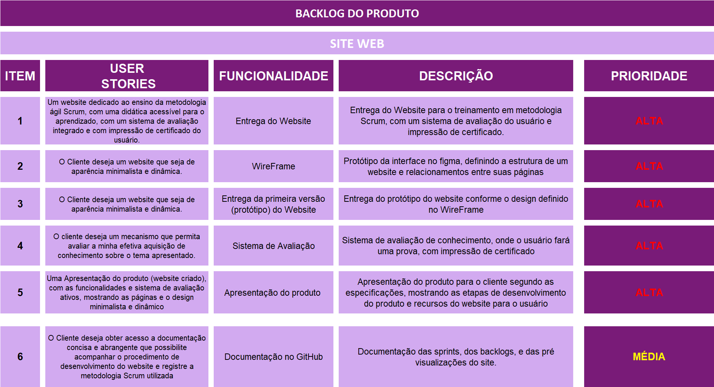
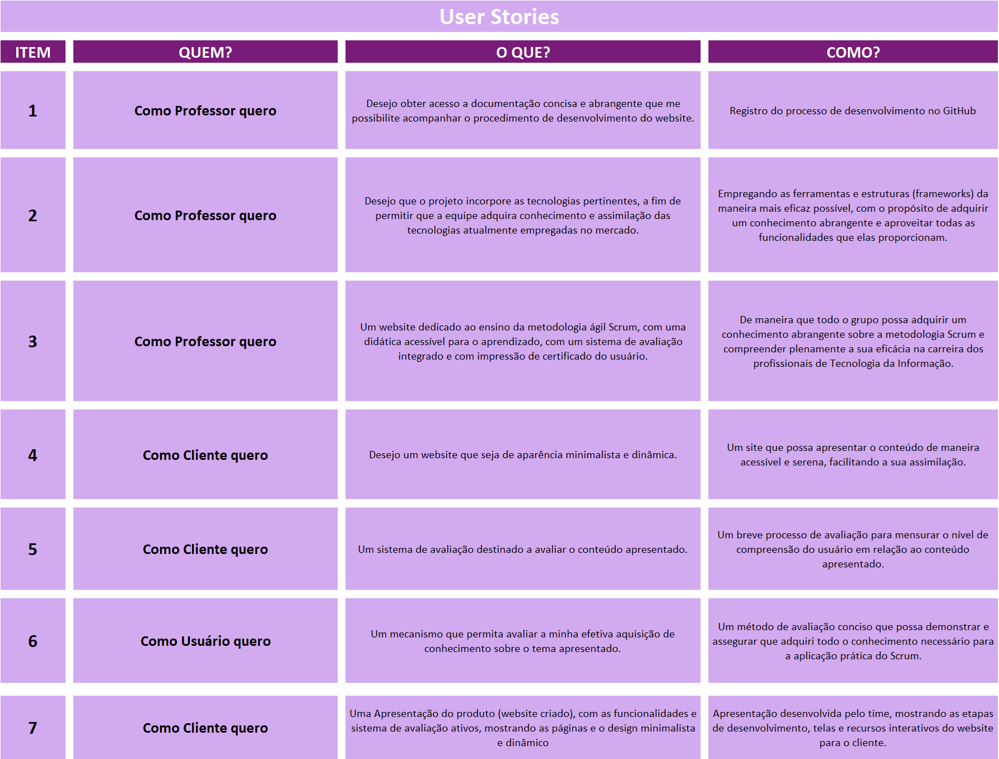
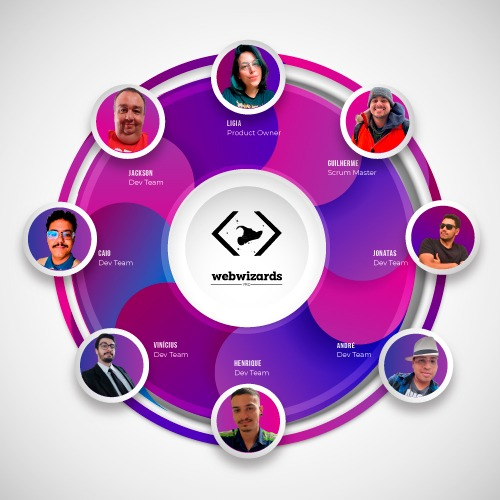

[](./imgs/logoWebWizardsPro.jpg)

<div align="center">
<h1>
<a  href="#bookmark_tabs-entregas-de-sprints">Entrega das Sprints</a> | <a  href="#clipboard-organização">Organização</a> | <a  href="#bust_in_silhouette-userstories">UserStorie</a> | <a  href="#triangular_flag_on_post-backlogs">Backlog List</a> | <a  href="#chart_with_downwards_trend-burndown">Burndown</a> | <a  href="#computer-instalação">Instalação</a> | <a  href="#page_facing_up-wireframe">Wireframe</a> | <a  href="#busts_in_silhouette-equipe">Equipe</a> | <a  href="#scroll-requisitos-do-cliente">Requisitos do cliente</a>
</h1>
</div>

# :pencil:Sobre o Projeto

Sistema web feito pela **WebWizards Pro**, com fins didaticos mostrando a metodologia ágil **Scrum**, com formulário de avaliação e geração de certificado. Feito em uma aplicação web, primando por sua intuitividade e acessibilidade, visando atender às necessidades do usuário final.

### :pushpin:Status do Projeto: Em andamento :construction:

# :bookmark_tabs: Entregas de Sprints

Cada entrega foi realizada a partir da data definida com o cliente, o relatório completo do que foi desenvolvido nas sprints. Observe a relação a seguir:

| Sprint  | Previsão de Entrega   | Status                        | Histórico                                      |
| ------- | --------------------- | ----------------------------- | ---------------------------------------------- |
| :one:   | :calendar: 29/09/2023 | :white_check_mark: Finalizada | :round_pushpin: [Ver Relatório](./Sprint01.md) |
| :two:   | :calendar: 26/10/2023 | :white_check_mark: Finalizada | :round_pushpin: [Ver Relatório](./Sprint02.md) |
| :three: | :calendar: 23/11/2023 | :white_check_mark: Finalizada | :round_pushpin: [Ver Relatório](./sprint03.md) |

# :clipboard: Organização

O projeto foi organizado em 2 repositórios, sendo:

Documentação [Github](https://github.com/cGuilhermec/DocumentacaoWebWizardPro)

Web [Github](https://github.com/cGuilhermec/WebWizardsPro)

##### [:rocket: Voltar ao topo ](#bookmark_tabs-entregas-de-sprints)

# :triangular_flag_on_post: Backlogs

O **Backlog List** do produto:
[](./imgs/Backlog_List.PNG)

# :scroll: Requisitos do Cliente

O **Requisitos do Cliente**:

<a  href="./docs/Requisitos de Cliente 1DSM - 2023-2.pdf">Requisitos do Cliente</a>

# :bust_in_silhouette: UserStories

[](./imgs/UserStories.png)

## :wrench: Tecnologias Utilizadas

   
   

## :computer: Instalação

Você precisa ter o [VsCode](https://code.visualstudio.com/download) para rodar o projeto.

Você precisará rodar o comando para clonar o repositório.

```sh
git clone https://github.com/cGuilhermec/devSolutions.git

cd devSolutions

code .
```

##### [:rocket: Voltar ao topo ](#bookmark_tabs-entregas-de-sprints)

## :page_facing_up: Wireframe

[](https://www.figma.com/file/NlvWUeXkm24HkJzpUlTSe8/Web-Wizards?type=design&node-id=0-1&mode=design&t=d2QDJjhf6EplNvEl-0)

## :busts_in_silhouette: Equipe

[](./imgs/equipePhoto.jpg)

| Função        | Nome                              | Linkdim & Github                                                                                                                                                                                                                                                                                                                |
| ------------- | --------------------------------- | ------------------------------------------------------------------------------------------------------------------------------------------------------------------------------------------------------------------------------------------------------------------------------------------------------------------------------- |
| Project Owner | Ligia Ribeiro                     | [](https://github.com/ligribeiro) [](https://www.linkedin.com/in/liribeiro/)                                    |
| Scrum Master  | Guilherme Carvalho                | [](https://github.com/cGuilhermec) [](https://www.linkedin.com/in/guilherme-carvalho-1b8b08156/)                |
| Dev Team      | André de Holanda Ventura          | [](https://github.com/AndreHVentura) [](https://www.linkedin.com/in/andrehventura/)                             |
| Dev Team      | Jonatas Filipe Carvalho Ferreira  | [](https://github.com/filipejonatas) [](https://www.linkedin.com/in/jonatas-filipe-aa4534165/)                  |
| Dev Team      | Henrique Pintor de Melo           | [](https://github.com/HenriquePmelo) [](https://www.linkedin.com/in/henrique-pintor-92448a28b/)                 |
| Dev Team      | Vinicius Barbosa Fernandes        | [](https://github.com/Viniciusfernandes2) [](https://www.linkedin.com/in/vinicius-fernandes-6088a323b)          |
| Dev Team      | Jackson Rodrigo Costa Machado     | [](https://github.com/jacksonrcmachado) [](https://www.linkedin.com/in/jackson-rodrigo-costa-machado-b636a84a/) |
| Dev Team      | Caio Cesar Silva Azevedo dos Reis | [](https://github.com/CaiooAzevedoo) [](https://www.linkedin.com/in/caio-azevedo-dev/)                          |

##### [:rocket: Voltar ao topo ](#bookmark_tabs-entregas-de-sprints)
