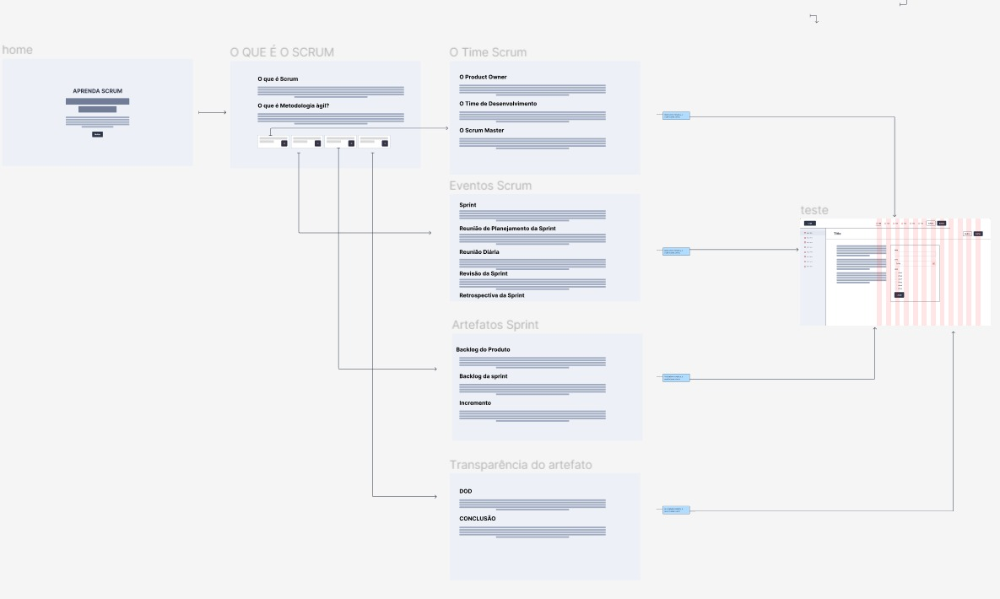

<h1>Sprint 01   

04/09/2023 à 28/09/23

 <a  href="#dart-objetivo-da-sprint">Objetivo da Sprint</a> | <a  href="#triangular_flag_on_post-sprint-backlog">Backlog da Sprint</a> | <a  href="#page_facing_up-wireframe">Wireframe</a> | <a  href="#clipboard-kanbam-trello">Kanbam</a> | <a  href="#pushpin-apontamentos">Apontamentos</a>

# :dart: Objetivo da Sprint

- Os objetivos desta sprint foram centrados na entrega do wireframe ao cliente, distribuição e organização de tarefas de acordo com a expertise de cada membro do grupo e planejamento das próximas entregas de sprints conforme combinao com o cliente.

# :triangular_flag_on_post: Sprint Backlog

# :chart_with_downwards_trend: Burndown Sprint 01

##### [:rocket: Voltar ao topo ](#dart-objetivo-da-sprint)

# :page_facing_up: Wireframe

# :clipboard: Kanbam (Trello)

A equipe toda se organizou para estudar e estruturar a disposição do wireframe. Para entregar da melhor forma o wireframe para o cliente, visando a preparação para o site.

##### [:rocket: Voltar ao topo ](#dart-objetivo-da-sprint)

# :pushpin: Apontamentos

No início da sprint, deparamo-nos com um desafio no que concerne à organização das tarefas prioritárias. Cada membro da equipe tinha sua própria perspectiva sobre a sequência de ações a serem tomadas, resultando em pequenos desentendimentos durante as reuniões diárias. Contudo, após uma construtiva conversa com a Product Owner (PO), que possui um vasto conhecimento em relação ao planejamento e à condução de projetos, incluindo a elaboração de wireframes e os passos subsequentes, conseguimos estabelecer uma estrutura mais sólida e seguir adiante com o projeto de forma mais harmoniosa.

##### [:rocket: Voltar ao topo ](#dart-objetivo-da-sprint)
