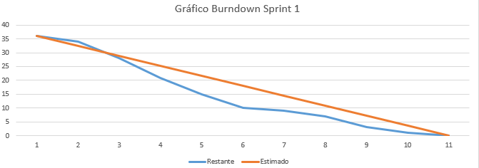

 

### :beginner: Sprint 01 :beginner:

### :date: 04/09/2023 à 28/09/23 :date:

 
<a  href="#dart-objetivo-da-sprint">Objetivo da Sprint</a> | <a  href="#triangular_flag_on_post-sprint-backlog">Backlog da Sprint</a> | <a  href="#page_facing_up-wireframe">Wireframe</a> | <a  href="#clipboard-kanbam-trello">Kanbam</a> | <a  href="#pushpin-apontamentos">Apontamentos</a>

### :clapper: [Video da Primeira Sprint](https://www.youtube.com/watch?v=Ull8qatsICw&feature=youtu.be&ab_channel=GuihCarvalho)

#### [ :house: Voltar para home](./README.md)

# :dart: Objetivo da Sprint

- Os objetivos desta sprint foram centrados na entrega do wireframe ao cliente, distribuição e organização de tarefas de acordo com a expertise de cada membro do grupo e planejamento das próximas entregas de sprints conforme combinao com o cliente.

# :triangular_flag_on_post: Sprint Backlog

# :chart_with_downwards_trend: Burndown Sprint 01

##### [:rocket: Voltar ao topo ](#dart-objetivo-da-sprint)

# :page_facing_up: Wireframe

# :clipboard: Kanbam (Trello)

A equipe toda se organizou para estudar e estruturar a disposição do wireframe. Para entregar da melhor forma o wireframe para o cliente, visando a preparação para o site.

##### [:rocket: Voltar ao topo ](#dart-objetivo-da-sprint)

# :hotsprings: Sprint Review

Após uma reunião abrangente com toda a equipe, realizamos uma análise minuciosa e constatamos que a primeira Sprint foi bem-sucedida em relação às metas estabelecidas. Todos os entregáveis planejados foram efetivamente concluídos. Além disso, conseguimos adiantar determinados aspectos para a segunda Sprint, otimizando assim o processo. A documentação exigida pelo User Story do professor encontra-se em conformidade com os requisitos, mantendo harmonia em relação às expectativas.

No que concerne ao User Story do cliente, embora haja ainda poucos elementos específicos de seu interesse, já estabelecemos a estrutura das páginas, um componente fundamental para o progresso do projeto. Como equipe, chegamos à conclusão de que estamos no caminho certo com relação a esse User Story.

No contexto do User Story do usuário, embora não tenham ocorrido mudanças substanciais, a organização das páginas representa uma melhoria notável para a experiência do usuário. Uma página bem estruturada e organizada facilitará a incorporação dos elementos visuais no futuro. Portanto, concluímos que estamos adequadamente organizados e alinhados com os objetivos estabelecidos. Nossa intenção é continuar com este método e manter o mesmo nível de comprometimento de toda a equipe, visando atender plenamente às expectativas deste projeto. Se percebermos a necessidade de ajustes, estaremos prontos para efetuá-los, visando uma entrega ainda mais precisa e aprimorada na sinergia da equipe.

# :pushpin: Apontamentos

No início da sprint, deparamo-nos com um desafio no que concerne à organização das tarefas prioritárias. Cada membro da equipe tinha sua própria perspectiva sobre a sequência de ações a serem tomadas, resultando em pequenos desentendimentos durante as reuniões diárias. Contudo, após uma construtiva conversa com a Product Owner (PO), que possui um vasto conhecimento em relação ao planejamento e à condução de projetos, incluindo a elaboração de wireframes e os passos subsequentes, conseguimos estabelecer uma estrutura mais sólida e seguir adiante com o projeto de forma mais harmoniosa.

##### [:rocket: Voltar ao topo ](#dart-objetivo-da-sprint)
