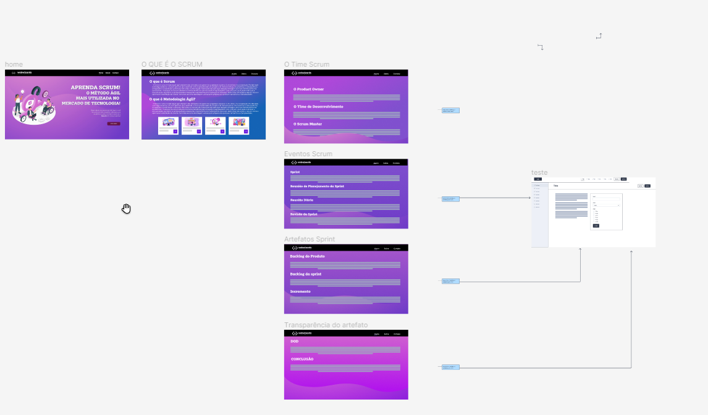

### :beginner: Sprint 02 :beginner:

### :date: 02/10/2023 à 26/10/23 :date:

<h1>
<a  href="#dart-objetivo-da-sprint">Objetivo da Sprint</a> | <a  href="#triangular_flag_on_post-sprint-backlog">Backlog da Sprint</a> | <a  href="#page_facing_up-wireframe">Wireframe</a> | <a  href="#clipboard-kanbam-trello">Kanbam</a> | <a  href="#pushpin-apontamentos">Retrospectiva sprint 2</a> | <a  href="#hotsprings-sprint-review">Sprint Review</a>
</h1>

#### [ :house: Voltar para home](./README.md)

# :dart: Objetivo da Sprint

- Os propósitos desta iteração se concentraram na consecução do protótipo do website, na alocação e estruturação das responsabilidades relativas à codificação em HTML e CSS, atribuídas a cada integrante da equipe, bem como na concepção e agendamento das futuras entregas das iterações, alinhadas às disposições previamente acordadas com o cliente.

# :triangular_flag_on_post: Sprint Backlog

# :chart_with_downwards_trend: Burndown Sprint 02

##### [:rocket: Voltar ao topo ](#dart-objetivo-da-sprint)

# :page_facing_up: Wireframe

# :clipboard: Kanbam (Trello)

A equipe se uniu de forma coordenada para analisar e desenvolver a estrutura do protótipo web. Nosso objetivo é entregar o protótipo ao cliente de maneira otimizada, considerando a interatividade do cliente com as páginas e fornecendo uma visão antecipada do design final do site.

##### [:rocket: Voltar ao topo ](#dart-objetivo-da-sprint)

# :hotsprings: Sprint Review

Após uma análise detalhada, chegamos à conclusão de que estamos efetivamente cumprindo os requisitos estabelecidos nos User Stories do professor dentro dos prazos previamente estipulados. Embora tenham surgido algumas observações, estas não representam desafios substanciais e são de natureza menor. A equipe está unânime em relação a esses pontos, portanto, na próxima e última iteração, continuaremos a seguir o mesmo padrão estabelecido.

Quanto ao User Story do cliente, apesar de também estarmos dentro do cronograma, ocorreu um atraso na entrega do protótipo, que engloba aspectos visuais, como cores, fontes, imagens e elementos gráficos. Isso resultou na não entrega completa do escopo desejado. Entretanto, as discrepâncias observadas não estão fora do planejado e podem ser corrigidas na última iteração. Neste contexto, chegamos a um consenso de que a atenção aos detalhes é crucial, uma vez que fazem toda a diferença. Portanto, há aspectos a serem refinados no User Story do cliente.

Em relação ao User Story do Usuário, também houve um leve atraso, e reconhecemos que poderíamos ter entregue mais elementos. No entanto, os entregáveis desta iteração já representam uma melhoria significativa para a experiência do usuário. A organização do conteúdo no site visa a facilitar a compreensão e absorção das informações.

Como equipe de desenvolvimento, identificamos áreas nas quais podemos melhorar nosso desempenho para garantir que tudo seja entregue conforme planejado na última iteração. Reconhecemos que a comunicação é essencial para o progresso bem-sucedido do projeto.

# :pushpin: Retrospectiva sprint 2

No início desta iteração, nos deparamos com um desafio em relação ao estilo e à tipografia das páginas. Cada membro da equipe apresentou perspectivas individuais sobre a sequência de ações a serem adotadas, semelhante ao problema que foi encontrado no sprint 1.

No entanto, a Product Owner (PO), que possui profundo conhecimento em estilização e padronização de projetos, forneceu orientação esclarecedora sobre a melhor abordagem e esquema de cores para a experiência do usuário.

Após essa instrução, e tendo em vista o aprendizado que o time teve no sprint 1 procedemos a uma reorganização e à atribuição de tarefas para evitar uma perda desnecessária de tempo e concluir todos os trabalhos dentro do prazo da Sprint, visando assegurar que o produto entregue ao cliente fosse esteticamente atraente e harmonioso.

##### [:rocket: Voltar ao topo ](#dart-objetivo-da-sprint)
