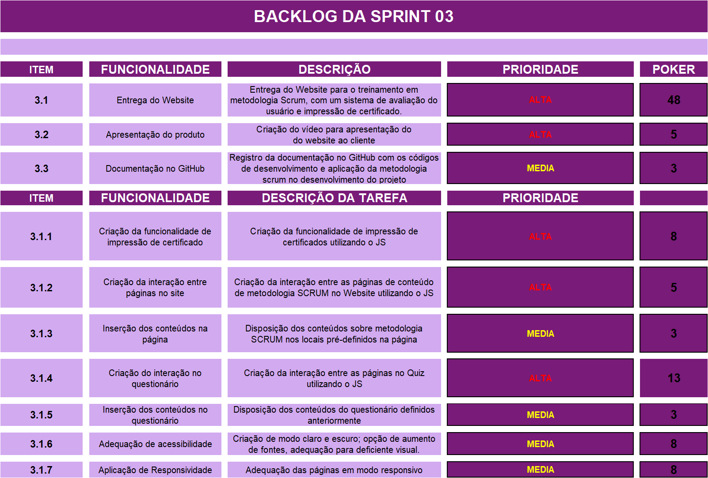
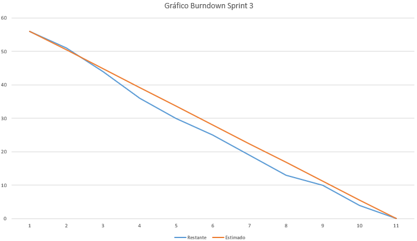
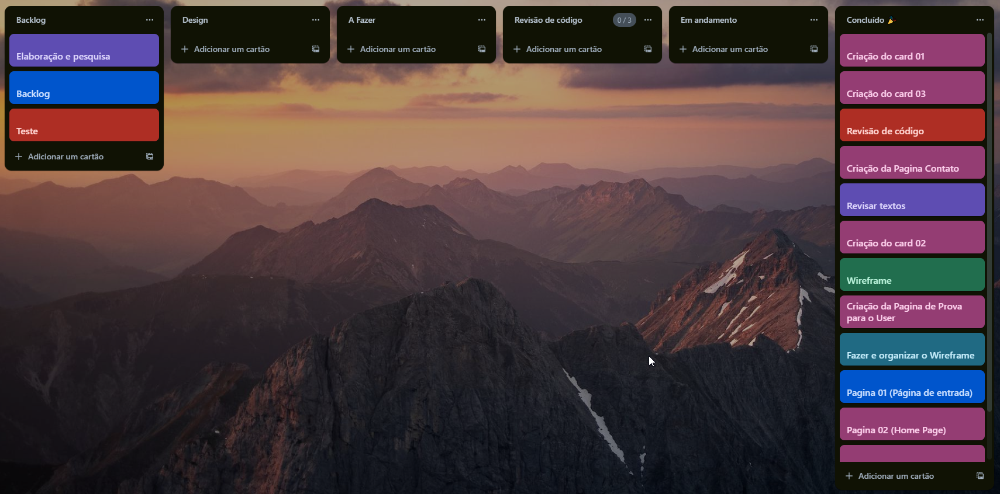

### :beginner: Sprint 03 :beginner:

### :date: 26/10/2023 à 23/11/23 :date:

<h1>

<a  href="#dart-objetivo-da-sprint">Objetivo da Sprint</a> | <a  href="#triangular_flag_on_post-sprint-backlog">Backlog da Sprint</a> | <a  href="#page_facing_up-wireframe">Wireframe</a> | <a  href="#clipboard-kanbam-trello">Kanbam</a> | <a  href="#pushpin-apontamentos">Retrospectiva sprint 3</a> | <a  href="#hotsprings-sprint-review">Sprint Review</a>

</h1>

#### [ :house: Voltar para home](./README.md)

# :dart: Objetivo da Sprint

- O objetivo da sprint 3 é a entrega final do website com as funcionalidades para avaliação de aprendizado da metodologia scrum com os conteúdos dispostos em todo site, além da apresentação final do produto com sua documentação no GitHub.

# :triangular_flag_on_post: Sprint Backlog

# :chart_with_downwards_trend: Burndown Sprint 02

##### [:rocket: Voltar ao topo ](#dart-objetivo-da-sprint)

# :page_facing_up: Wireframe

# :clipboard: Kanbam (Trello)

A equipe se uniu de forma coordenada para analisar e desenvolver a estrutura do protótipo web. Nosso objetivo é entregar o protótipo ao cliente de maneira otimizada, considerando a interatividade do cliente com as páginas e fornecendo uma visão antecipada do design final do site.

##### [:rocket: Voltar ao topo ](#dart-objetivo-da-sprint)

# :hotsprings: Sprint Review

Nesta última review, ponderamos os requisitos que foram estabelecidos no user stories, onde a entrega de todo o site deveria ser feita ao final do prazo da sprint, assim como todo o resto da documentação juntamente com as outras entregas.

O item 3.1.1 de impressão de certificado demandou um esforço maior por parte da equipe, devido a sua complexidade e as múltiplas interações existentes entre seus elementos, assim como os itens 3.1.4 e 3.1.5 em que as interações feitas em javascript, que acabou causando erros e bugs em que os integrantes como um time tiveram que superar para realizar a entrega e fazer as interações entre as páginas funcionarem.

Devido a experiência anterior na sprint, a equipe conseguiu contornar os problemas, principalmente com relação a prazo e as funcionalidades para que o website pudesse ser um produto satisfatório.

# :pushpin: Retrospectiva sprint 3

Em relação a esta sprint, o time encontrou um desafio um pouco diferente se comparado as sprints anteriores. As atividades iriam demandar mais do dev team na parte de desenvolvimento de código, com tarefas na área principalmente de certificado concentrando a maior parte dos esforços.

Vindo das sprints anteriores, o time evitou perder tempo no começo da sprint em relação a organização de tarefas, e começar a distribuir as tarefas de modo que o prazo fosse cumprido.

Conforme o desenvolvimento da sprint, algumas situações em que o prazo estaria findando e a entrega do produto ao cliente era iminente com as funcionalidades (na parte de certificado principalmente), levou que o dev team tivesse confiança em alguns membros mais experientes e que possuíam maior desenvoltura na parte de desenvolvimento do código pudessem mostrar o melhor caminho ao time como todo para que o produto estivesse satisfatório e o prazo cumprido.

##### [:rocket: Voltar ao topo ](#dart-objetivo-da-sprint)
